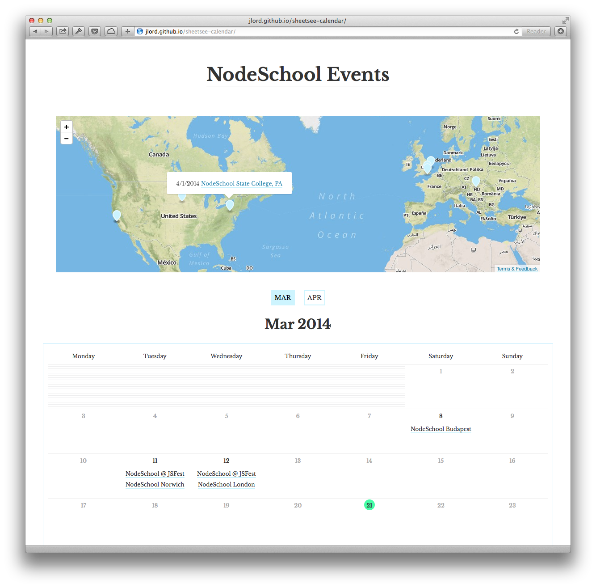

# Including a Map

If you want to include a map on your calendar page, the `with-map` [branch](https://github.com/jlord/sheetsee-calendar/tree/with-map) has it all set up for you.

For more on using Sheetsee.js to generate maps, read the [documentation](http://jlord.github.io/sheetsee.js/docs/sheetsee-maps.html).

## Geocoding  

Geocoding is turning addresses (i.e. "Sydney, Austrailia" or "1600 Pennsylvania Avenue") into lattitude and longitude coordinates (i.ee "49.560, 12.089").

Most map providers require you to sign up for a special key to be able to use their geocoding services. There are a couple slightly easier ways to do it without a key.

- **Find the lat/long coordinates yourself.** You can add a 'lat' and a 'long' column to  your sreadsheet and manually add the coordinates yourself from typing the address into a site like [latlong.net](http://www.latlong.net).
- **Use MapBox's city-level Geocoder Plugin** MapBox has a Google Spreadsheet [plugin](https://www.mapbox.com/tilemill/docs/guides/google-docs/#geocoding) that creates an extra 'Geo' menu at the top of your spreadsheet. With this you can select a column of addresses and geocode them to the city-level (not street-level). When selecting a geocoding service, choose MapQuest and you can leave the API key field blank.
- _Note: sheetsee.js accepts columns named: latitude, longitude; lat, long; geo_longitude, geo_latitude._